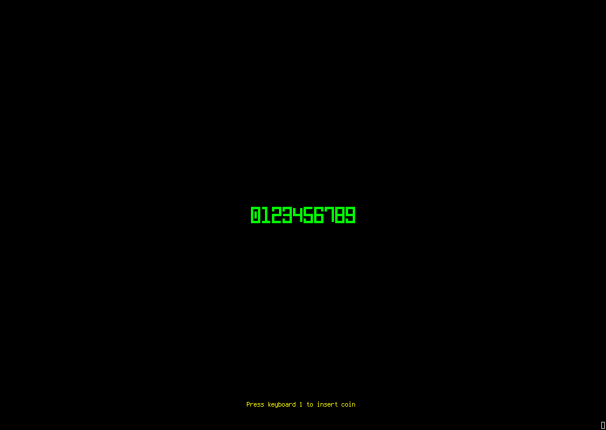
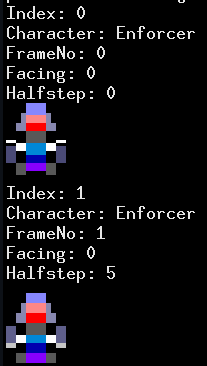

# Blopotron



**WASD** to move. **IJKL** to shoot. That's it.

Survive waves of enemies in a terminal. 
No tutorials, no cutscenes, no inventory. Survive and score points. 
An homage groundbreaking ROBOTRON 2084 dual-joystick arcade shooter.

---

## What This Is

A single-file C game (`blopotron47.c`) that runs in two modes:

- **SDL mode**: A development artefact - verify positions of sprites etc
- **Text mode**: ANSI terminal rendering via [sprite_bridge.py](https://github.com/clort81/SpriteBridge)

Currently ASCII-Only.  UTF-8 colored sprites are all made, but integration is WIP

## Controls

```
Movement:  W A S D
Shooting:  I J K L
```

Eight directions. Move and shoot independently.  Using SDL to combine keydowns with debouncing for diagonals.
Eventual terminal play will need to have a direction key and seperate 'stop key' (e.g. the '5' on the NumPad).

## Building

```bash
# Debug 
gcc -g -Wall -O0 -o blopotron-dbg blopotron.c -lSDL2

# Text mode (terminal)
gcc -O2 -o blopotron blopotron.c -lSDL2
```

Running ./blopotron with the `-t` flag spawns `sprite_bridge.py` as a subprocess and renders to stdout. Works over SSH, in tmux, eventually on a real BBS with suitable player-input handling.

## Status

Working. Single-player, endless waves, increasing difficulty. Text-mode rendering is functional but still being optimized for slow links.

Sprite loading and rendering is delayed for after real-world playtesting using placeholder sprites.

## Novel Concept: "Sub-Character Animation"

**Sub-Character animation with Meta-Sprites:**
A "Meta-Sprite" (msprite) is a higher-level abstraction that decouples the *logical* position of an entity in the game world from its *visual* representation on the terminal grid. Instead of a sprite being just a dumb grid of characters, a meta-sprite is a collection of frames, each tagged with semantic metadata:
1. **Facing (0-8)**: Which of the 8 compass directions the sprite is oriented toward.
2. **Halfstep (0-8)**: Whether this specific frame is designed to be rendered at an integer grid coordinate (0), or offset by 0.5 in a specific direction (1-8) to simulate sub-cell movement.

**The Capability It Buys Us:**
This enables **sub-cell resolution animation**. In traditional terminal games, an entity's Y-coordinate is an integer. Moving from row 4 to row 5 is an instantaneous, jerky "teleport." By introducing a "halfstep" frame, the game engine can say: *"The entity's logical Y-coordinate is 4.5. Therefore, render the halfstep frame."*

That halfstep frame is pre-drawn using half-block characters (like `▀` or `▄`) or clever color-bleeding techniques so that, when drawn at row 4, it visually appears to occupy the space *between* row 4 and row 5. Combined with 8-way facing, this allows entities to glide smoothly across the screen, with their visual representation interpolating seamlessly between grid cells, while the underlying game logic remains clean, tracking entity positions in higher resolution than the terminal's target-grid resolution.

Enforcer with a second frame for display when game world position resolves to 'in between' two terminal rows.



**Why It’s a Total Novelty in ANSI Terminal Games:**
Historically, ANSI/ASCII games (like `NetHack`, `Rogue`, or classic BBS doors) are strictly **cell-bound**. An entity is either at `(X, Y)` or it isn't. There is no "in-between." Achieving smooth movement traditionally required either:
1. Accepting jerky, grid-snapped movement.
2. Writing incredibly complex, real-time ASCII morphing algorithms in the game loop.

The meta-sprite approach flips this. It pre-bakes the sub-cell offsets and directional variants into the asset itself. The game loop doesn't need to do any complex ASCII manipulation; it just evaluates `facing` and `halfstep`, looks up the correct pre-rendered frame, and sends a single `DRAW` command. It brings the fluidity of vector or pixel-art sub-pixel rendering to the terminal, with zero runtime overhead. It is, effectively, **sub-pixel rendering for ASCII**.


## Why Who What?

Over 10 years ago i started making ansi-colored utf-8 sprites for the classic game ROBOTRON 2084.  I wanted to make an old school BSD-style terminal game like `hunt`, `robots`, `trek` — small, self-contained games that ran on any terminal. I wanted particularly to implement the idea of sub-character sprite animation in terminal arcade games.  

This repository is a small reflectino of thousands of hours of experimentation and exploration towards that goal.

## License

FSL-1.1-MIT
Accredation to clort + targeted help from GLM, Qwen and MiMo.
