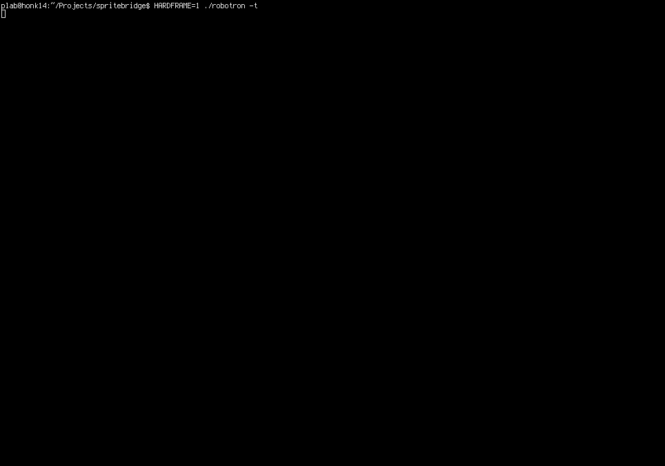

# Blopotron



**WASD** to move. **IJKL** to shoot. That's it.

Survive waves of enemies in a terminal. No tutorials, no cutscenes, no inventory. Just you, the duality-joystick scheme, and an ever-growing swarm trying to kill you.

---

## What This Is

A single-file C game (`blopotron47.c`) that runs in two modes:

- **SDL mode**: Classic 2D rendering with procedural sprites
- **Text mode**: ANSI terminal rendering via [sprite_bridge.py](https://github.com/clort81/SpriteBridge)

No game assets. No texture files. No config files. Everything is drawn from code.

## The Idea

Modern games ship with gigabytes of assets, engines, and build pipelines. This is the opposite: one C file, one dependency (SDL2 for graphics mode), and a Python script for terminal output.

The goal is didactic — to show that a complete, playable game can fit in a single source file without external tools or asset pipelines. The kind of thing you could type into a VT100 in 1984 if you had the patience.

## Features

- **Robotron-style dual-joystick controls**: Move with WASD, shoot with IJKL
- **Procedural sprites**: All graphics generated from code, no PNGs or tilemaps
- **Text-mode rendering**: Play in any ANSI terminal via sprite_bridge.py
- **Adaptive framerate**: Dynamic frame skipping for slow backends (BBS, SSH)
- **Level transitions**: Zooming rainbow boxes between waves
- **Enemy types**: Grunts, electrodes, spheroids, humans to rescue

## Controls

```
Movement:  W A S D
Shooting:  I J K L
```

Eight directions. Move and shoot independently. Classic dual-joystick scheme.

## Building

```bash
# SDL mode (graphics)
gcc -o blopotron blopotron47.c -lSDL2
./blopotron

# Text mode (terminal)
gcc -o blopotron blopotron47.c -lSDL2
./blopotron -t
```

The `-t` flag spawns `sprite_bridge.py` as a subprocess and renders to stdout. Works over SSH, in tmux, or on a real BBS.

## Status

Working. Single-player, endless waves, increasing difficulty. Text-mode rendering is functional but still being optimized for slow links.

Not done. The BBS door integration (via [late.sh](https://github.com/mpiorowski/late-sh)) is in progress. Multiplayer is a maybe-someday.

## Why

Because writing a game that runs in a terminal is a purer exercise in game design than writing one that runs in a browser. No assets to produce, no shaders to tune, no layout engines to fight. Just characters, colors, and logic.

This is the kind of project that existed in the BSD days — `hunt`, `robots`, `trek` — small, self-contained games that lived in `/usr/games` and ran on any terminal. No installers, no dependencies, no documentation beyond a man page.

If this is useful to you, fork it. If it isn't, that's fine too.

## License

Public domain. Use it however you want.
