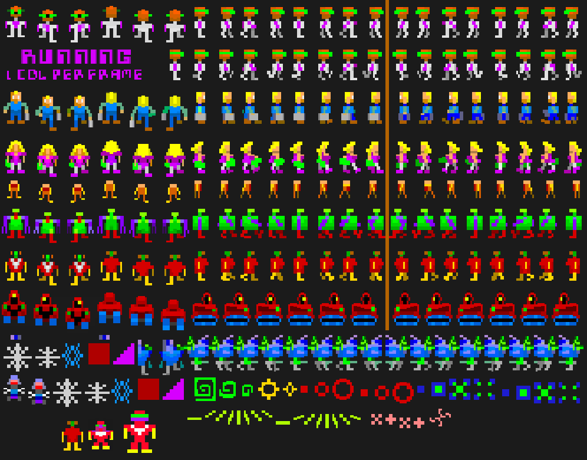

# Blopotron: Terminal Arcade Game


A pure terminal, single-file C Robotron-style shooter. [WIP]

Survive waves of enemies in your terminal. No tutorials, no cutscenes, no inventory, and no external graphics libraries. Just you, the dual-joystick scheme, and an ever-growing swarm trying to kill you.

## What This Is
A single-file C game that runs entirely in the ANSI terminal. It features a custom, high-performance offscreen text buffer engine that renders smooth, half-step sub-pixel motion using UTF-8 box-drawing characters. 

No game assets. No texture files. No Python bridges. No SDL. Everything is drawn directly from code to `stdout`.

## The Idea
Modern games ship with gigabytes of assets, engines, and build pipelines. This is the opposite: one C file, zero external dependencies, and a custom rendering pipeline. 

The goal is didactic — to show that a complete, playable, smooth-framerate game can fit in a single source file without external tools. The kind of thing you could compile and run on any POSIX system in 1984.

## Features
- **Pure Terminal Rendering**: No SDL, no `sprite_bridge.py`. Direct ANSI escape code and UTF-8 output.
- **Half-Step Quantization**: Smooth sub-pixel entity movement rendered using 1/2-step UTF-8 block characters (`█`, `▌`, `▐`, `▄`, `▀`, `▗`, `▖`, `▝`, `▘`).
- **Decal System**: 
  - *Floor Decals*: Grey/white pulsing `╳` marks left behind when a Hulk crushes a human.
  - *Overlay Decals*: Rainbow color-cycling score popups (e.g., "1000", "5000") that appear when humans are rescued.
- **Advanced HUD**: 7-digit green box-drawing score display (top-left) and right-aligned white player life icons (top-right, capped at 10).
- **Spatial Grid Optimization**: Fast $O(1)$ neighborhood lookups for collision detection and AI targeting.
- **Classic Enemy Behaviors**: Grunts swarm, Hulks chase and crush humans, Spheroids retreat to corners to spawn Enforcers, and Enforcers orbit while firing Terrors.

## Controls
The game uses an "autorun" movement scheme and continuous autofire, eliminating the need to hold down multiple keys simultaneously.

**Movement** (Autorun):
- `W` : Up
- `X` : Down
- `A` : Left
- `D` : Right
- `Q`, `E`, `Z`, `C` : Diagonals (Up-Left, Up-Right, Down-Left, Down-Right)
- `S` : Stop movement

**Shooting** (Continuous Autofire):
- `Numpad 7, 8, 9, 4, 6, 1, 2, 3` : Fire continuously in the chosen direction.
- `Numpad 5` : Stop firing.

*(Note: Because this uses raw terminal input, your terminal emulator must be configured to send repeated key events when a key is held down, which is the default behavior on most modern systems.)*

## Building
Requires a standard C compiler (GCC or Clang) and the math library.

```bash
# Compile with optimizations and warnings
gcc -O2 -Wall bta.c -o bta -lm

# Run the game

./bta



## Why Who What?

Over 10 years ago i started making ansi-colored utf-8 sprites for the classic game ROBOTRON 2084.  I wanted to make an old school BSD-style terminal game like `hunt`, `robots`, `trek` — small, self-contained games that ran on any terminal. I wanted particularly to implement the idea of sub-character sprite animation in terminal arcade games.  

This repository is a small shard broken off of thousands of hours of R&D (play) towards that goal.

## License

FSL-1.1-MIT
Accredation to clort + targeted help from GLM, Qwen and MiMo.
