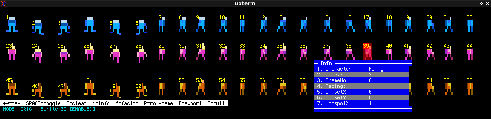
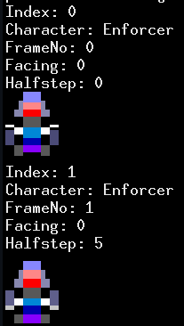
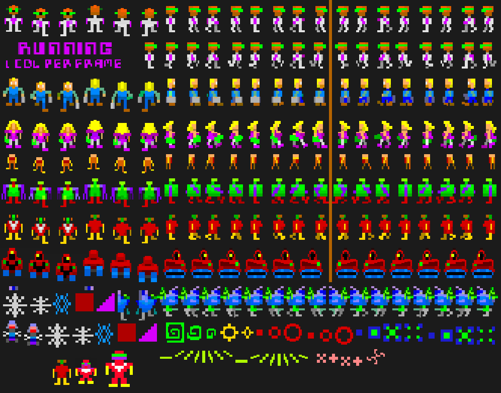

# Blopotron: Terminal Arcade Game


A pure terminal, single-file C Robotron-style shooter.  Human-designed in 2015, boosted to playable with help from Qwen and GLM. [WIP]

Survive waves of enemies in your terminal. No tutorials, no cutscenes, no inventory, no gpu needed. Just you in terminal-land, the dual-joystick scheme excitingly mapped to keyboard, and an ever-growing swarm trying to kill.



## Why JABACFT? (just another bad arcade clone for terminal)?
*Blopotron introduces something NEW*: clever character design enables sub-character-cell animation for smooth(ish) motion in a standard ANSI terminal.  It does not need sixel, kitty protocol or anything else fancy.  Just a terminal emulator (xterm) with utf-8, VT100 DECCTL and truecolor ECMA-48 ANSI Color support!

## Features
- **Pure Terminal Rendering**: Direct ANSI escape code and UTF-8 output.
- **Half-Step Quantization**: Smooth sub-pixel entity movement rendered using 1/2-step UTF-8 block characters (`█`, `▌`, `▐`, `▄`, `▀`, `▗`, `▖`, `▝`, `▘`).
.
- **Decal System**: 
  - *Floor Decals*: Grey/white pulsing `╳` marks left behind when a Hulk crushes a human.
  - *Overlay Decals*: Rainbow color-cycling score popups (e.g., "1000", "5000") that appear when humans are rescued.
- **80s HUD**: 7-digit green score display (top-left) and right-aligned white player life icons (top-right, capped at 10).
- **Spatial Grid Optimization**: Fast $O(1)$ neighborhood lookups for collision detection and AI targeting.
- **Slight variants on Classic Enemy Behaviors**: Grunts swarm, Hulks chase and crush humans, Spheroids retreat to corners to spawn Enforcers, and Enforcers orbit while firing Terrors.

## Controls
The game uses an "autorun" movement scheme and continuous autofire, enabling play over ssh without direct key events (keydown/keyup) input.

**Movement** (Autorun):
- `W` : Up
- `X` : Down
- `A` : Left
- `D` : Right
- `Q`, `E`, `Z`, `C` : Diagonals (Up-Left, Up-Right, Down-Left, Down-Right)
- `S` : Stop movement

**Shooting** (Continuous Autofire):
- `Numpad 7, 8, 9, 4, 6, 1, 2, 3` : Fire continuously in the chosen direction.
- `Numpad 5` : Stop firing.

*(Note: Because this uses STDIO terminal input, the game does not track keydown and keyup events. You will need to learn to move and stop moving with 's' and stop firing with '5')*

## Building
Requires a standard C compiler (GCC or Clang) and the math library.

```bash
# Compile with optimizations and warnings
gcc blopogfon.c -o blopotron

# Run the game

./blopotron
```
## TODO: 

There's a lot of work sunk into sprites that are 4-5 rows high and it's just too big for the whole-view game.  These could be used for a 'slidig widow' where the terminal view shows just a small portion of the larger arena. 


A new small 2-3 row spriteset is underway, which by ratios of original game means a 2-row, 4-5 column wide sprite needs an overall terminal resolution of about 38 rows height and 120 rows width.  By extrapolation the 4-5 row sprites would need about a 80 row tall terminal, about 240 columns wide -- a bit much.

Brains and their cruise missiles.  Tanks, Quarks, Progs.   This game will not attempt to duplicate robotron2084 gameplay but offer something similar.

## Why Who What?

Over 10 years ago i started making ansi-colored utf-8 sprites for the classic game ROBOTRON 2084.  I wanted to make an old school BSD-style terminal game like `hunt`, `robots`, `trek` — small, self-contained games that ran on any terminal. I wanted particularly to implement the idea of sub-character sprite animation in terminal arcade games.  

This repository is a small shard broken off of thousands of hours of R&D (play) towards that goal.

## License

FSL-1.1-MIT
Accredation to clort + targeted help from GLM, Qwen and MiMo.
